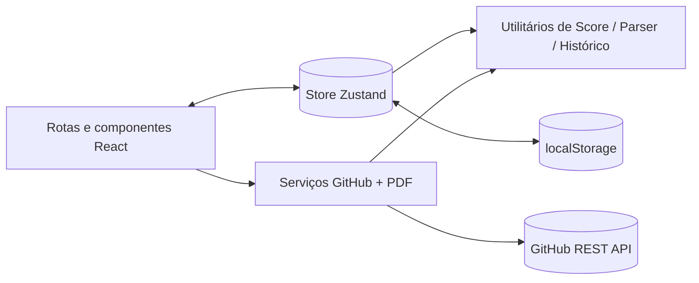

# DevCheck

Ferramenta de checklist de boas práticas para engenharia sênior. Avalia a qualidade de qualquer projeto de software, gera uma pontuação, um diagnóstico e uma lista de melhorias acionáveis.

O DevCheck audita projetos em cinco pilares de engenharia — Testes Automatizados, Documentação, CI/CD, Qualidade de Código e Arquitetura & Versionamento — e devolve uma pontuação geral (0–100), um diagnóstico narrativo curto e dicas priorizadas de melhoria. Opcionalmente consome dados públicos de repositórios do GitHub para pré-preencher respostas.

## Stack

| Camada          | Biblioteca / Ferramenta                  |
| --------------- | ---------------------------------------- |
| UI              | React 19 + TypeScript (modo estrito)     |
| Build           | Vite 7                                   |
| Roteamento      | TanStack Router (file-based)             |
| Estilização     | Tailwind CSS v4 (design tokens próprios) |
| Estado          | Zustand                                  |
| Exportação PDF  | jsPDF + html2canvas                      |
| Testes          | Vitest + React Testing Library + jsdom   |
| Cobertura       | @vitest/coverage-v8                      |
| CI              | GitHub Actions                           |

## Instalação

```bash
bun install
cp .env.example .env
bun run dev
```

## Variáveis de ambiente

| Variável                    | Padrão                   | Função                                              |
| --------------------------- | ------------------------ | --------------------------------------------------- |
| `VITE_APP_ENV`              | `development`            | Controla o selo de ambiente e a saída do logger     |
| `VITE_APP_VERSION`          | `1.0.0`                  | Exibido no rodapé                                   |
| `VITE_APP_NAME`             | `DevCheck`               | Exibido no rodapé                                   |
| `VITE_GITHUB_API_BASE_URL`  | `https://api.github.com` | URL base para a integração com o GitHub             |

Quando `VITE_APP_ENV=production`, o selo fica oculto e o logger é silenciado.

## Scripts

```bash
bun run dev              # inicia o servidor de desenvolvimento
bun run build            # build de produção
bun run preview          # serve o build
bun run lint             # eslint
bun run test             # roda todos os testes
bun run test:watch       # modo watch
bun run test:coverage    # relatório de cobertura (texto + HTML)
```

O relatório de cobertura é gerado em `./coverage/index.html`.

## Estrutura de pastas

```
src/
├── components/   # Componentes React de apresentação
├── constants/    # Dados estáticos (definição do checklist)
├── hooks/        # Hooks React reutilizáveis
├── routes/       # Rotas file-based do TanStack (páginas)
├── services/     # Integrações com efeito colateral (GitHub, PDF)
├── store/        # Store Zustand
├── tests/        # Testes de integração + setup do Vitest
├── types/        # Tipos TypeScript compartilhados
└── utils/        # Utilitários puros (score, parser, histórico, logger)
```

## Arquitetura



A lógica de negócio fica em `src/utils/` e `src/services/`. Os componentes apenas renderizam UI e despacham ações para a store Zustand.

## Metodologia de pontuação

- Sim = pontuação cheia; Parcial = metade da pontuação; Não = zero.
- Cada categoria é normalizada para uma escala de 0–100.
- A pontuação geral é a média ponderada igualitária das categorias.
- Faixas de cor: `0–40` vermelho · `41–70` âmbar · `71–100` verde.

Dicas de melhoria são geradas apenas para respostas marcadas como `Parcial` ou `Não`.

## Testes

```bash
bun run test
bun run test:coverage
```

Os testes unitários cobrem `scoreCalculator`, `githubParser` e `historyManager`. Os testes de integração cobrem o controle segmentado, a barra de progresso e o pipeline de resultados.

## Integração contínua (CI)

O workflow do GitHub Actions em `.github/workflows/ci.yml` roda automaticamente em cada `push` e `pull request` para a branch `main` e executa, nesta ordem:

1. `bun install --frozen-lockfile`
2. `bun run lint`
3. `bun run test`
4. `bun run build`

Qualquer falha em uma das etapas reprova o build do PR.

## Deploy (Vercel)

1. Envie o repositório para o GitHub.
2. Importe o projeto na Vercel.
3. Preset de framework: Vite. Build command: `bun run build`. Output directory: `dist`.
4. Adicione as variáveis do arquivo `.env.example` em Settings → Environment Variables.
5. Faça o deploy.

O conteúdo gerado em `dist/` também funciona em Netlify, Cloudflare Pages ou qualquer hospedagem estática.

## Alinhamento com ISO 9126

A norma ISO 9126 define seis características de qualidade de software. Os cinco pilares do DevCheck mapeiam diretamente para essas características:

| Pilar DevCheck | Característica ISO 9126 | Justificativa |
| --- | --- | --- |
| Testes Automatizados | **Confiabilidade** | Testes garantem maturidade, tolerância a falhas e recuperabilidade do sistema |
| Documentação | **Manutenibilidade** | Documentação melhora analisabilidade e capacidade de mudança do código |
| CI/CD | **Portabilidade** | Pipelines automatizados viabilizam implantação consistente em diferentes ambientes |
| Qualidade de Código | **Manutenibilidade** | Linting, formatação e convenções reduzem a complexidade e facilitam mudanças |
| Arquitetura & Versionamento | **Manutenibilidade** | Estrutura clara e histórico de commits diminuem o custo de evolução do sistema |

## Alinhamento com MPS.BR

O MPS.BR (Melhoria de Processo do Software Brasileiro) organiza a maturidade de processos em níveis e áreas de processo. Os pilares do DevCheck cobrem as seguintes áreas:

| Pilar DevCheck | Área de Processo MPS.BR | Nível de Maturidade |
| --- | --- | --- |
| Testes Automatizados | **VER** — Verificação / **VAL** — Validação | G (básico) |
| Documentação | **GRH** — Gerência de Recursos Humanos | F |
| CI/CD | **GCO** — Gerência de Configuração | G (básico) |
| Qualidade de Código | **GQA** — Garantia da Qualidade | G (básico) |
| Arquitetura & Versionamento | **DES** — Desenvolvimento | C |

> As áreas de processo VER, VAL, GCO e GQA pertencem ao nível G (patamar mínimo exigido pelo MPS.BR), que é o ponto de entrada para a certificação.

## Alinhamento com sustentabilidade

- **ODS 4 — Educação de Qualidade**: reforça boas práticas de engenharia através de feedback acionável.
- **ODS 9 — Indústria, Inovação e Infraestrutura**: eleva o patamar de qualidade do software entregue pelos times.

## Licença

MIT — veja `LICENSE`.